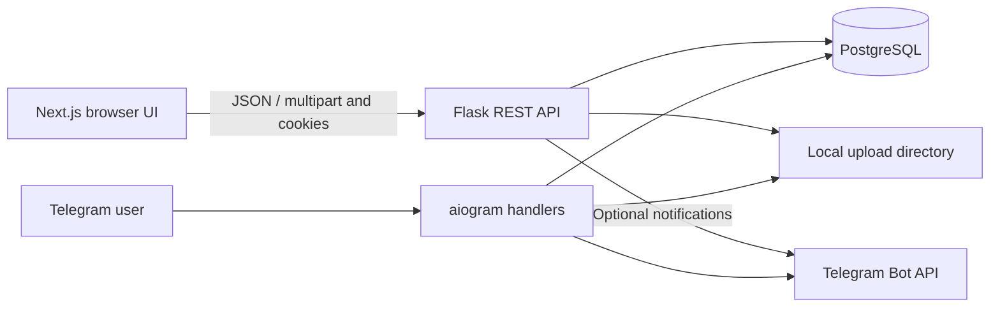
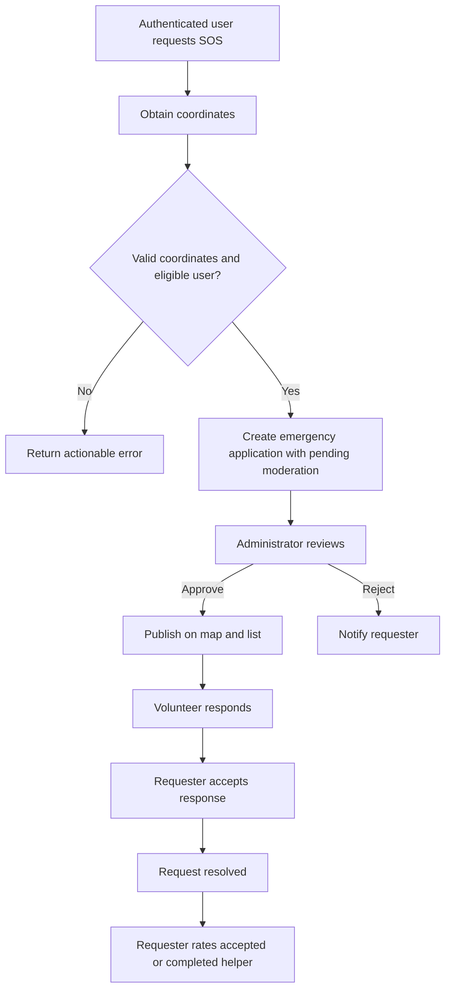

# Architecture and SOS flow

Prepared from the current code during reconstruction; this is not a recovered original diagram.

The browser uses Next.js App Router. The client calls Flask JSON endpoints through the Next.js `/api` rewrite by default; `NEXT_PUBLIC_API_URL` can select an explicit backend origin. Authentication uses Flask-Login session cookies. SQLAlchemy stores users, requests, responses, ratings, media metadata, news and notifications in PostgreSQL. Uploaded bytes live under `backend/instance/uploads`.

The Telegram bot uses aiogram FSM handlers and the same database models. Telegram identity is associated with a web user through `telegram_id`. The browser never receives the bot token.

CORS currently permits the configured localhost origins with credentials. API authentication errors return JSON 401; browser HTML routes retain login redirects. The application factory accepts explicit test configuration so the same route registration is exercised in automated checks.

