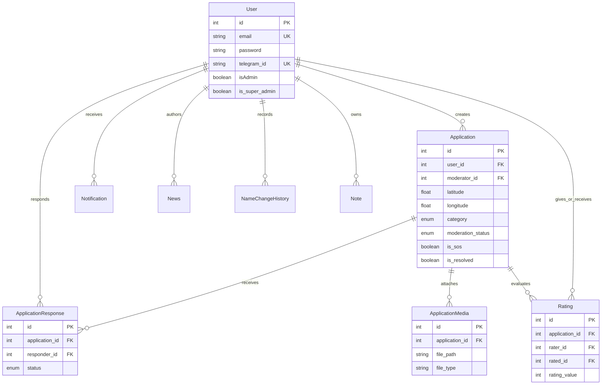

# Database model

Reconstructed from `backend/website/models.py`. PostgreSQL is the production storage; SQLite is used only by the fast default test suite.

Categories: `food`, `medicine`, `shelter`, `emergency`. Moderation: `pending`, `approved`, `rejected`. Responses: `pending`, `accepted`, `completed`, `cancelled`. UI labels must not substitute for persisted enum values.

The existing application bootstrap creates tables before running Alembic. The initial migration adjusts foreign keys rather than creating the entire schema. The news migration therefore checks for an already bootstrapped table. This compatibility behavior is retained; the project has not been redesigned into a migrations-only startup workflow.

